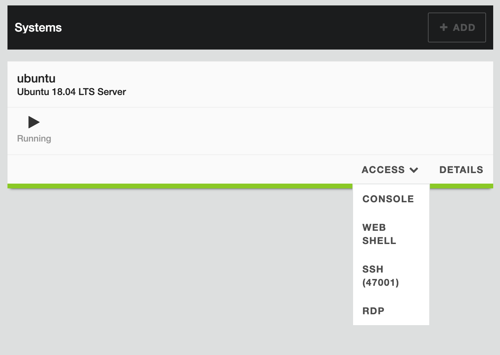
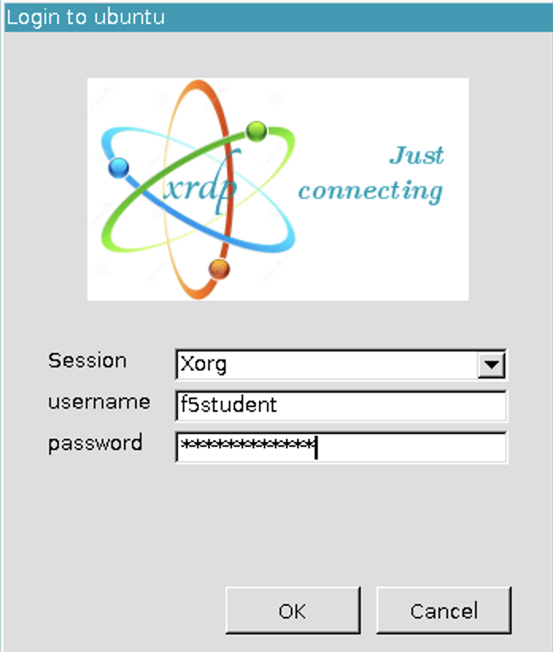
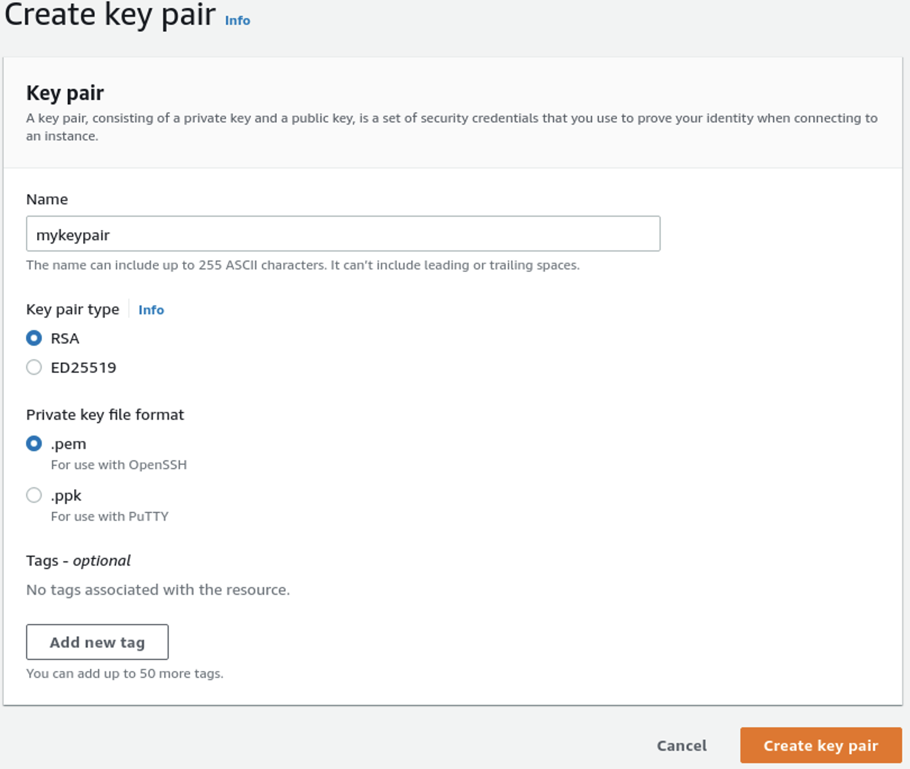
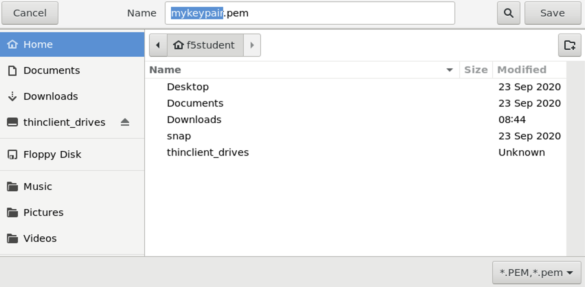
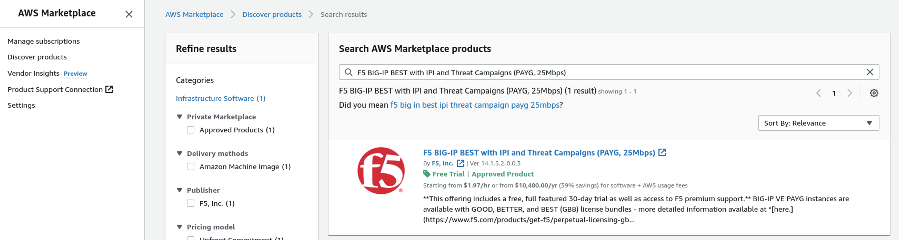

# Getting Started

## How to start
Before being able to deploy Cloud Solution Templates v2 in AWS, a couple of things need to be sorted.

This workshop makes use of an UDF Blueprint which can be found following this link: 
https://udf.f5.com/b/2c537e6f-8851-4539-a0c1-c03761b56e16#documentation.

## Login to UDF
1. Go to the UDF deployed lab environment and select `Access` at the Jumphost and click `RDP`.

2. In de RDP connection select `Connect` and ignore the warning that the identity could not be verified and click `Yes`.
3. Login to the Ubuntu Jumphost with **f5student/f5student123**.

4. Ignore `Authentication Required` and hit `Cancel`.
5. In the top left corner, select `Activities` and than select `Chrome`.
6. Go back to the UDF Blueprint and open the `Cloud Accouns` tab and:
   - Copy the `Console URL` and paste it into the Jumphost browser. AWS Console login opens.
   - `IAM user name` is `udf`.
   - From the `Clount Accounts` tab, copy the **password** and paste into the AWS Console and hit `Sign in`.
7. Check your **Region** in the right uppercorner. If needed, change it to region `Europe (Frankfurt) eu-central-1`.

## Create SSH Keys in AWS
  
1. Click `Services` and select `EC2`.
2. Go to **Network & Security > Key Pairs** and select `Create key pair`.
3. Give it a name **mykeypair** and leave everything else at its default. Click `Create key pair`.

4. Save **mykeypair.pem** to the `f5student/home` folder.

5. From `Activities` select the purple icon which opens a `Terminal`.
6. Type **ls** to check if the key pair is stored in the home folder.
7. Set the owner/permissions 
  
   **chmod 400 myprivatesshkey.pem**.

We will use this key pair at a later stage to SSH into instances, deployed in AWS.

## Subscribe to F5 EULA

  The F5 product used for this workshop is `F5 BIG-IP BEST PAYG 25MB` and we need to sign the EULA first, otherwise the BIG-IP deployment will fail.

  1. In the **AWS Console** go to the searchbar and search for `AWS Marketplace Subscriptions` and select it.
  2. In the **left pane** select `Discover product` and copy and paste `F5 BIG-IP BEST with IPI and Threat Campaigns (PAYG, 25Mbps)` in the search bar and hit enter.

  3. Select the first search result `F5 BIG-IP BEST with IPI and Threat Campaigns (PAYG, 25Mbps)` and click **Continue to Subscribe**.
  4. Select **Accept Terms**.
  5. Under `Terms and Conditions` you will find a table which shows `pending` wait for it to finish. It will take a minute or two before it publishes the 'effective date' and 'expiration date' of the subscription.

You have completes this task.

[PREVIOUS](../README.md)      [NEXT](../docs/0_Getting_Started.md)