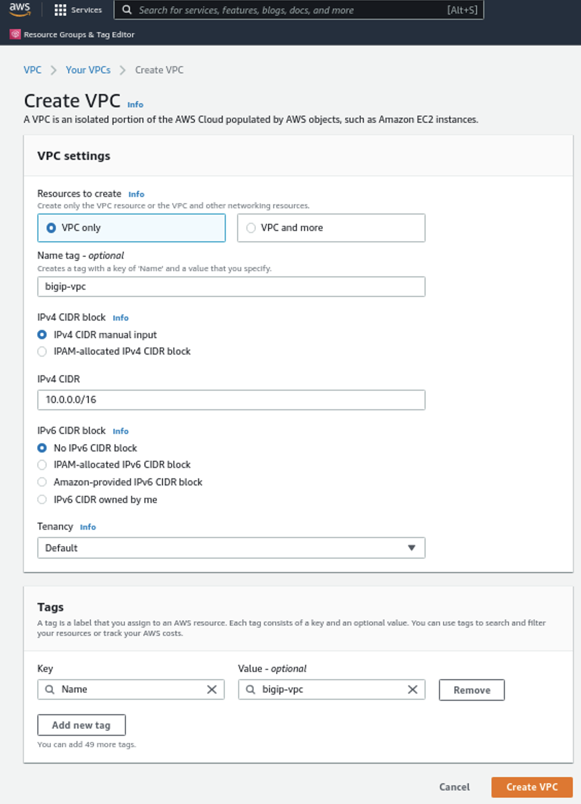
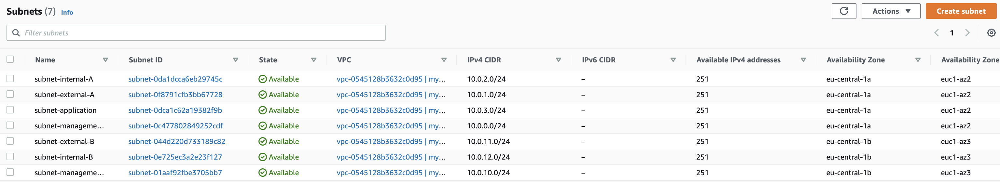
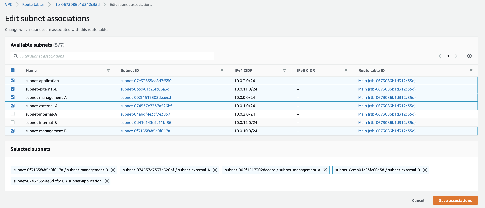

# Task 1 - Prepare the AWS Infrastructure

To be able to deploy a Cloudformation template which expects an existing infrastructure, we first need to create one.

This task will guide you through the setup and minimum requirements by configuring:
- a Virtual Private Network (VPC);
- Subnets for management, external and internal networking in different availability zones;
- an Internet gateway; and
- a Route Table.

## Create a VPC
1. Select `Services` in the upper left corner (next to the AWS icon) and select `VPC`.
2. To manually create a VPC hit: 
3. Select `VPC only`.
4. Give the VPC a name like **bigip-vpc**.
5. We only use IPv4 CIDR and give it a value of **10.0.0.0/16**.
6. Hit `Create VPC`.

## Create Subnets
1. In the **VPC** console, in left Pane, right under **Your VPCs**, select `Subnets`.
2. In the next window, select `Create Subnet` in the upper right corner.
3. At **VPC ID** select your just created **my-bigip-vpc**.
4. There need to be 7 subnets configured. Please use the below **table** for the correct naming, availability zone and IPv4 CIDR block. You can `Add new subnet` to setup all subnets in one go and hit `Create subnet` once ready.

| **Subnet name** | **Availability Zone** | **IPv4 CIDR block** |
|---|---|---|
| subnet-management-A | eu-central-1a | 10.0.0.0/24 |
| subnet-external-A | eu-central-1a | 10.0.1.0/24 |
| subnet-internal-A | eu-central-1a | 10.0.2.0/24 |
| subnet-application | eu-central-1a | 10.0.3.0/24 |
| subnet-management-B | eu-central-1b | 10.0.10.0/24 |
| subnet-external-B | eu-central-1b | 10.0.11.0/24 |
| subnet-internal-B | eu-central-1b | 10.0.12.0/24 |

After deployment in AWS it should like this.

## Create an Internet Gateway
An internet gateway allows communication between your VPC and the Internet.
1. In the **VPC** console, in the left pane, select `Internet gateways`.
2. Hit `Create internet gateway` in the upper right corner.
3. Give it a name like **bigip-igw** and select `Create internet gatway`.
4. The deployed internet gateway needs to be attached to the VPC. In the `Internet gateway` section select **bigip-igw** click `Actions` in the upper right corner and select **Attach to VPC**.
5. In `Available VPCs` select **bigip-vpc** and hit **Attach internet gateway**.

## Create a Route Table
1. In the **VPC** console, in the left pane, select `Route tables`.
2. Select `Create route table`.
3. Give the route table a name like **bigip-route-table**.
4. Select the `VPC` **bigip-vpc**.
5. Create the route table by pressing `Create route table`.
6. In the **bigip-route-table** window, select `Subnet associations`.
7. At **Explicit subnet associations** hit `Edit subnet associations` at the right side of the window.
8. Select `subnet-management-A, subnet-external-A, subnet-management-B, subnet-external-B and subnet-application` and hit **Save associations**.

9. In **bigip-route-table** select `Edit routes`.
10. Press `Add route` to set a default route of **0.0.0.0/0** and click in the empty field of `Target` to select `Internet Gateway` from the pull-down menu and select **bigip-igw**.
11. Hit **Save changes**.

This task is completed.

[PREVIOUS](../docs/0_Getting_Started.md)      [NEXT](../docs/2_Deploy_BIG-IPs_with_CSTv2.md)