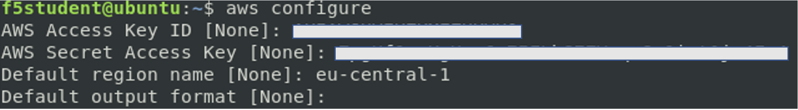
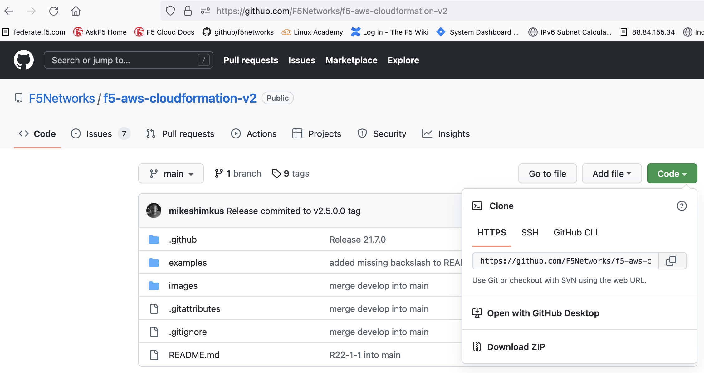
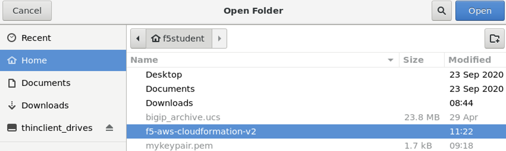
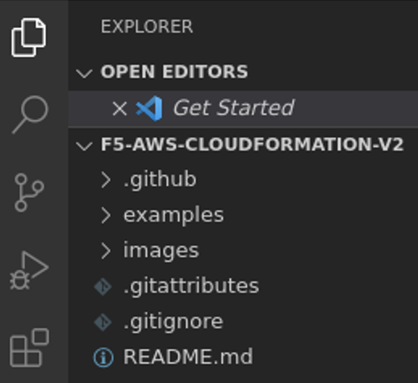
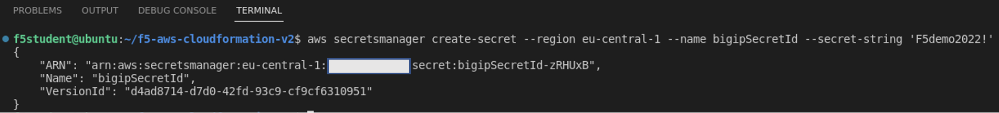

# Deploy a Cloud Solution Template v2 in AWS

AWS Cloudformation templates will be used to deploy F5 BIG-IP Virtual Edition. The AWS CSTv2 templates can be found at: https://github.com/F5Networks/f5-aws-cloudformation-v2 and in this lab we will deploy BIG-IP failover which can be found when clicking `examples` in the Github folder.

```
Note: The template can be deployed by using the GUI or via AWS CLI. Since UDF has some limitations when using the AWS GUI, AWS CLI will be used during this deployment. When you use your own AWS account this limitation might not exist.
```

This task will provide:
- Setup the Jumphost to use AWS CLI.
- Clone and modify the AWS CSTv2 repo from Github.
- Create a secret stored in AWS secret manager.
- Walk through the steps to use the F5 CSTv2 cloudformation template.

## Ubuntu Jumphost
The Ubuntu Jumphost is part of the UDF deployment and has AWS CLI installed. 
1. Login to the Ubuntu Jumphost using RDP.
2. At the login screen type the username and password (f5student/f5student123) and hit `OK`.
3. ignore `Authentication Required` by hitting **Cancel**.
4. Start an **Terminal** by selecting `Activities` and hit the purple icon at left pane.
5. In the terminal type: **aws --version**. The output should be simular to the below output.

```
f5student@ubuntu:~$ aws --version
aws-cli/1.18.69 Python/3.6.9 Linux/4.15.0-176-generic botocore/1.16.19
```
6. Set the AWS credentials via the terminal by typing at cmd line: **aws configure**.
7. Go to the UDF page in the browser and select the `cloud account`.
8. Copy the `AWS Access Key ID` from the clount account and paste it into the **aws configure** at the jumphost terminal.
9. Do the same for the `AWS Secret Access Key`.
10. Set the `Default region name` to **eu-central-1**.
11. Keep the `Default output format` as **None** by just pressing **Enter**.
12. (Optional) When you want to verify your AWS creds once more type the following cmd: **cat ~/.aws/credentials**. You can compare the output with what has been configured from previous steps.




## Clone AWS CSTv2 from Github
1. At the Ubuntu Jumphost, go to `Activities` and from the left pane select **VSC** .
2. Open a terminal pane by selecting **Terminal > New Terminal**.
3. Browse to https://github.com/F5Networks/f5-aws-cloudformation-v2 and click the **Green Code button** and copy the URL to your clipboard.



4. In Jumphost VSC Terminal type: **git clone <i>'paste the github URL repo'</i>**.
5. In VSC, select `Open Folder` and select **f5-aws-cloudformation-v2** and hit **Open**.



6. `F5-AWS-Cloudformation-v2` is now opened in VSC.




## Create a Secret
1. Stay in VSC at the Jumphost and set the VSC terminal again as done in step 2 in the previous section.

Let's create a secret which will get stored in AWS secrets manager and be used by the CSTv2 template to retrieve the BIG-IP password. This avoids sending passwords via API when deploying the BIG-IPs.

2. In `VSC Terminal` type the following AWS cmds:

**aws secretsmanager create-secret --region eu-central-1 --name bigipSecretId --secret-string 'F5demo2022!'**



```
Remark: the shown secretARN output is unique and will differ from yours!
```

## Deploy the CSTv2 template
Before being able to deploy we need to prepare the `parameters.json` file.
1. From the folder pane select **examples > failover > failover-existing-network-parameters.json**
2. Open **failover-existing-parameters.json** file and change the mentioned parameters. Leave everything else to its default.

   ```
   NOTE: Take your time to fill in this .json file, don't rush!! The template deployment will fail if you make a mistake.
   ```
   Some remarks when filling in the .json:
   - **cfeS3Bucket** - put your first name here and hit your keyboard for a random number just to be sure that your S3 bucket has globally unique name.
   - **...SubnetId...** - Go to **AWS console > VPC** and select the requested SubnetId **(not the name)** and copy/paste it into the `parameters.json`.
   - **bigIpSecretArn** - Copy and paste the secretARN from the AWS Secrets Manager.

| ParameterKey | ParameterValue |
|---|---|
| bigIpPeerAddr | 10.0.0.11 |
| cfeS3Bucket | <i>'your name'</i>-<i>'create random number'</i>-cloud-failover |
| cfeVipTag | 10.0.1.101,10.0.11.101 |
| bigIpExternalSelfIp01 | 10.0.1.11 |
| bigIpExternalSelfIp02 | 10.0.11.11 |
| bigIpExternalVip01 | 10.0.1.101 |
| bigIpExternalVip02 | 10.0.11.101 |
| bigIpExternalSubnetId01 | <i>'copy and paste subnet-external-A id'</i> |
| bigIpExternalSubnetId02 | <i>'copy and paste subnet-external-B id'</i> |
| bigIpInternalSelfIp01 | 10.0.2.11 |
| bigIpInternalSelfIp02 | 10.0.12.11 |
| bigIpInternalSubnetId01 | <i>'copy and paste subnet-internal-A id'</i> |
| bigIpInternalSubnetId02 | <i>'copy and paste subnet-internal-B id'</i> |
| bigIpMgmtAddress01 | 10.0.0.11 |
| bigIpMgmtAddress02 | 10.0.10.11 |
| bigIpMgmtSubnetId01 | <i>'copy and paste subnet-management-A id'</i> |
| bigIpMgmtSubnetId02 | <i>'copy and paste subnet-management-B id'</i> |
| bigIpSecretArn | <i>'paste the secretsARN here'</i> |
| provisionPublicIpMgmt | true |
| restrictedSrcAddressMgmt | 0.0.0.0/0 |
| restrictedSrcAddressApp | 0.0.0.0/0 |
| sshKey | <i>'SSH key **Name**'</i> |
| uniqueString | <i>'your name'</i>
| vpcId | <i>'copy and paste bigip-vpc id'</i>
|

3. Make sure you filled in all mentioned parameters before continuing and press **Ctrl+s** to save the file!
4. Deploy the CSTv2 template with the following AWS cmd:
- (Copy and paste it and say 'yes' you want to paste 4 lines of text.)

```
aws cloudformation create-stack --region eu-central-1 --stack-name bigip-failover \
--template-url https://f5-cft-v2.s3.amazonaws.com/f5-aws-cloudformation-v2/v2.5.0.0/examples/failover/failover-existing-network.yaml \
--parameters file://examples/failover/failover-existing-network-parameters.json \
--capabilities CAPABILITY_NAMED_IAM
```

This AWS cmd will deploy the CSTv2 example **failover** where the template will be taken from Github and the parameters are taken from the prepared local failover-existing-network-parameters.json.

5. Use the AWS console to go to **Services > CloudFormation** (optionally, use the search bar) and watch how the `Stack` gets build.
6. After 3 - 5min the BIG-IP instances are getting deployed. In AWS Console go to **Services > EC2 > Instances**.
7. Select `...vm-01` and copy the public IP address and open a SSH session using the SSH key you have stored. Check if the `Instance state` is `Running` and the `Status check` has `2/2 checks passed` before using SSH to login.

**ssh -i mykeypair.pem admin@<i>'bigip pubIP'</i>**

8. In BIG-IP via SSH, type **bash** to get the shell prompt.
9. Type **tail -f /var/log/cloud/bigIpRuntimeInit.log** amd hit `Enter`.

Watch how the runtime-init file gets configured on the BIG-IP.
- First the F5 Automation Toolchain packages are getting pulled from the F5 CDN and are getting installed.
- Then each F5 ATC defined script will get deployed.
- CSTv2 templates deliver the liberty to use different runtime-init scripts. This can be managed from the parameters.json file.

After a couple of minutes you will see a simular message as below which indicates that runtime-init is finished.

```
2022-10-12T12:15:05.313Z [9155]: info: All operations finished successfully
```

## Check the BIG-IP config
1. Stop the logging and use the cmd line to check what actually has been configured on the BIG-IP.
2. Examine the Runtime-init configuration being deployed.

   **cat /config/cloud/runtime-init.conf**

3. Check the deployed F5 Automated Toolchain declarations.

   **curl -u admin: http://localhost:8100/mgmt/shared/declarative-onboarding | jq .**

4. Examine the BIG-IP Cloud Failover declaration.

   **curl -su admin: http://localhost:8100/mgmt/shared/cloud-failover/declare | jq .**


## Check the BIG-IP
1. Use a browser to go to the **BIG-IP GUI https://<i>'bigip pubIP'</i>**.
2. When you check the BIG-IP status right next the F5 logo (left upper corner) it should say `In Sync` and the BIG-IP will have either an ACTIVE or STANDBY state. The BIG-IPs are deployed as a high available cluster.
3. Check if there are other partitions besides `Common`.

Runtime-init did not provide an application services (AS3) configuration and you will notice there is no active configuration residing on the BIG-IP.

4. Back at the AWS Console, check `CloudFormation`. The Parent template and all 'nested' templates show a status of `Create_Complete`.

This task is completed.


[PREVIOUS](../docs/1_Setup_the_VPC_and_More.md)      [NEXT](../docs/2_Deploy_BIG-IPs_with_CSTv2.md)
