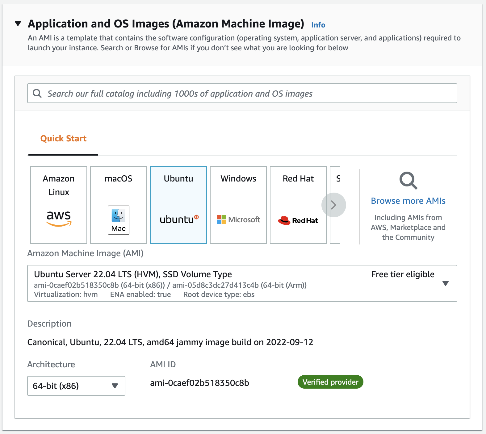
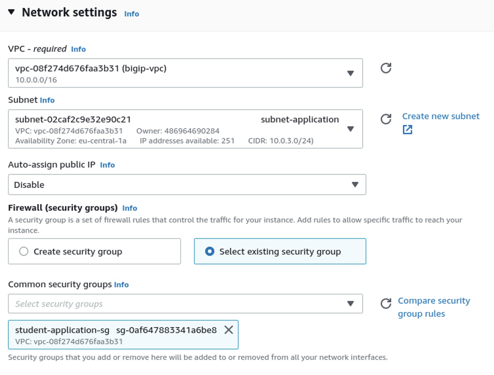
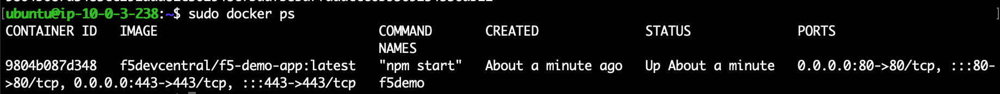

# Task 3 - Create an Application Server

The CSTv2 BIG-IP failover template involving an 'existing network' does not provide an demo application. In order to create a fully functional solution an demo application needs to be created first.

```
Note: When this guide is being followed while using a UDF AWS Cloud Account, you will be able to consume a max of 5 public IP addresses. This limitation makes that setting up an application server is done a bit different to avoid running out of public IP addresses.
```

This task provides manual steps to create an demo application:
- Deploy an Ubuntu instance.
- Add an Elastic IP to the instance.
- Installing Docker and running an `f5-demo-app` container.
- **!!Releasing the public IP address (mandatory)!!**

## Create the demo application
1. From the AWS services, select `EC2`. (When not showing up use the top search bar.)
2. At the left pane select `Instances New`. Notice no instances are deployed yet.
3. Click `Launch instances` in the upper right corner.
4. Give your new instance a name `f5-demo-app`.
5. From the `Application and OS Images` section, select `Ubuntu`.



6. Leave the **version** and **Instance type** at its default.
7. Select your generated `Key pair` from the **Getting_started** section. Otherwise generate one right now using the option on the right.
8. Press the `Edit` button at **Network settings**.
9. Check if the selected VPC is **my-bigip-vpc**.
10. Be sure to select the right subnet **subnet-application**.
11. Select `Select existing security group` and select **...application-sg**.



19. Launch the the instance by pressing 
20. Once the deployment is onging, select `View all instances` and refresh the EC2 page.


## Attach Elastic IP
1. In the EC2 Dasboard, go to **Network & Security > Elastic IPs** and click **Allocate Elastic IP address**. At the `Allocate Elastic IP address` page, just click **Allocate**.
2. At `Elastic IP addresses` select **Actions > Assocciate Elastic IP address**
3. Select the `Instance` **f5-demo-app**.
4. Select `Private IP address` and select **10.0.3.x** private IP host address of `f5-demo-app`.
5. Click **Associate**.

## Configure f5-demo-app
1. Login to the `f5-demo-app` Ubuntu instance from the system you have stored **mykeypair.pem**. Use the associated public IP address to SSH into it.

   **ssh -i mykeypair.pem ubuntu@<i>f5-demo-app-public-ip</i>>**

2. After login update the instance and install Docker:

   **sudo apt update -y && sudo apt install -y docker.io**

3. Deploy the `f5-demo-app` by running the container:

   **sudo docker run --name f5demo --restart always -p 80:80 -p 443:443 -d f5devcentral/f5-demo-app:latest**

4. Check if the application runs with **sudo docker ps**



5. Test the demo app:
    - From the cmd line **curl localhost**.
    - Copy the demo app public IP and paste it in a browser.

## !!!Release the Public IP!!!
1. Go to the **EC2 Dashboard > Instances > Instance settings > Disassociate Elastic IP address**.
2. On the `Disassociate Elastic IP address` page, select **Disassociate Elastic IP address**.
3. Type **proceed** in the field and hit **Disassociate**.

