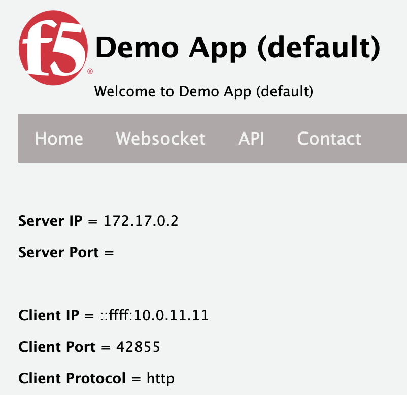

## Application Services Deployment

The Infrastructure is ready and the application has been setup. It's about time to deploy the application services which will make that the application can be consumed from the Internet.

This task will provide:
- Using F5 Extension for VSC.
- Deployed application service.
- Test the demo application through BIG-IP.
- Test failing over of BIG-IP.

## Create BIG-IP Secondary IPs
BIG-IP deployed as a VM instance in AWS needs secondary IP addresses to provide virtual server functionality.
1. In AWS EC2, select `...-bigip-vm01` and inspect the allocated private IPs. Notice that they all belong to an interface and are actually **selfIP's**. There are no VS addresses allocated.
2. Keep the BIG-IP selected and go to **Actions > Networking > Manage IP addresses**.
3. In `Manage IP addresses` select `eth1` and **assign a new IP address** with IP address **10.0.1.101** and hit `Save` and `Confirm`.

4. Do the same for `...-bigip-vm02`.
5. In AWS EC2, select `...-bigip-vm01` and inspect the allocated private IPs. Notice that they all belong to an interface and are actually **selfIP's**. There are no VS addresses allocated.
6. Keep the BIG-IP selected and go to **Actions > Networking > Manage IP addresses**.
7. In `Manage IP addresses` select `eth1` and **assign a new IP address** with IP address **10.0.11.101** and hit `Save` and `Confirm`.

## Associate Elastic IP with Virtual Server
Both secondary IPs are created and assigned to the respected BIG-IPs, but to become a real VIP it needs to get associated with a public IP address. The active BIG-IP should be the one getting associated. Let's follow the steps.
1. In AWS EC2, go to **Network & Security > Elastic IPs** and select the one IP without a description.
2. Give this EIP a description by edit the name **bigip-vip** and hit `Save`.

3. Go to **Actions > Associate Elastic IP**.
4. In `Associate Elastic IP address`:
- At `Resource type` select **Network interface**.
- At `Network interface` select the **external interface of the `Active` BIG-IP**.

5. Select **bigip-vip** once again and click `Tags` and select `Manage tags`.
6. Click `Add tag` and create two tags according to the values in the table and hit `Save`.

| Key | Value |
|---|---|
| f5_cloud_failover_label | bigip_high_availability_solution |
| f5_cloud_failover_vips | 10.0.1.101,10.0.11.101 |
|

## Deploy Application Service
With the VS private and public IP addresses set, next is to deploy the application services.
1. This workshop contains an AS3 file named `as3-https-service.json`, **open** it and copy the entire declaration's content.
2. At the Jumphost in VSC create a **new file** name it `as3-https-service.json` and paste the copied AS3 declaartion into this file.
2. In AWS EC2, select `f5-demo-app` to copy the private IP host address.
3. Paste this private IP host address in the pool member section and press **Ctrl+s**.

4. In VSC, select the `F5 icon` at the left side and add an `F5 Host` by clicking the **+**.
5. In the poped up center field enter **admin@<i>bigip-pub-ip</i>** of `...-bigip-vm-01` and hit **Enter**.
6. Select the just added F5 host and enter the **Password**. The BIG-IP now is connected via the F5 Extension in VSC.
7. The AS3 declaration is still open in the main pane, select it and right-click your mouse and select **Post as AS3 Declaration**.

8. Check the response being published after declaring and spot the `code: 200` and `message: success`.
9. Login to the BIG-IP and check, by changing the partition to `App_Services`, if the deployment was indeed succesful. 
- Check the **Local Traffic > Virtual Servers** section. Two VS show 'Green' icons.
- Check the **Pools** section. One Pool shows a 'Green' icon.

## Test F5 demo application
10. In AWS EC2, **Network & Security > Elastic IPs** and from **bigip-vip** copy the public IP address and paste into a browser. Ignore the risk warning and accept the risk. The demo application appears.

## Test BIG-IP failover
1. Make sure you have opened AWS EC2 **Network & Security > Elastic IPs**.
2. Log into the active BIG-IP and select `Online (ACTIVE)` in the upper left corner.

3. In the next window `Device Management > Traffic Groups`, select **Force to Standby** and hit the pop-up again to **Force to Standby**.
4. Go back to `EC2 Elastic IP` and the **bigip-vip** public to private IP association. 

Questions:
- did it change?
- To which BIG-IP does this VS belong?
- How much time did the failover take? (you can enforce a failover back and foreword to check)

5. Reload the `f5-demo-app` in your browser. It should just continue to work.

## (Optional) Check Cloud Failover log files
1. Log into each BIG-IP via SSH using a different terminal.
2. Once logged in type **bash** to ensure you are in shell mode.
3. In each terminal type **tail -f /var/log/restnoded/restnoded.log**.
4. Now enforce a failover and watch the logging carefully.

This task is completed.

[PREVIOUS](../docs/3_Create_Demo_App.md)  